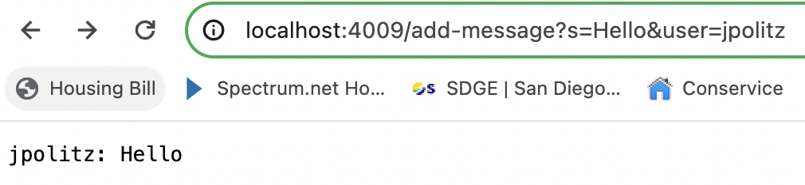
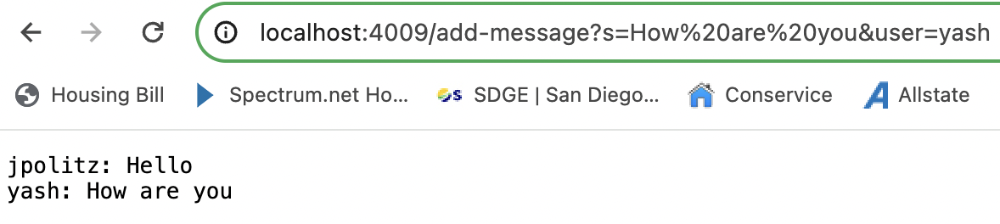
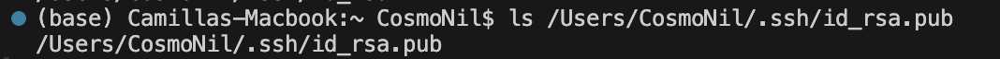
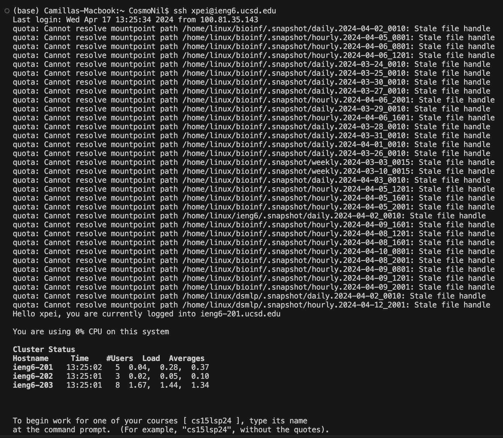

# Lab Report 2 - Servers and SSH Keys
## Part 1
codes for ```ChatServer```
```
import java.io.IOException;
import java.net.URI;

class Handler implements URLHandler {
    String result = "";
    public String handleRequest(URI url) {
        String query = url.getQuery();
        if(url.getPath().equals("/add-message")) {
            if(query.startsWith("s=")) {
                String parts = query.split("=")[1];
                String message = parts.split("&")[0];
                String user = query.split("=")[2];
                String old = user + ": " + message;
                result = result + old + "\n";
                return String.format("%s\n", result);
            }
        }
        return "404 Not Found!";
    }
}

class ChatServer {
    public static void main(String[] args) throws IOException {
        if(args.length == 0){
            System.out.println("Missing port number! Try any number between 1024 to 49151");
            return;
        }

        int port = Integer.parseInt(args[0]);

        Server.start(port, new Handler());
    }
}
```
using ```/add-message```

*Screenshot 1*


Methods called, relevate arguments and relevant fields of the class, and how do values of any relevant fields of the class change from this specific request: 
1. Method: ```handleRequest```. Parameter: ```URI url```. Argument: http://localhost:4009/add-message?s=Hello&user=jpolitz
2. Method: ```getQuery()```. Parameter: url. Argument: none.
3. Method: ```getPath()```. Parameter: url. Argument: none.
4. Method: ```equals()```. Parameter: Object. Argument: ```"/add-message"```.
5. Method: ```startWith()```. Parameter: String. Argument: ```"s="```. 
6. Method: ```split()```. Parameter: String. Arugment: ```"="```, ```"="```. 
7. Method: ```Stringformat()```. Parameter: String. Argument ```"%s\n", result```.
8. Field: String query = http://localhost:4009/add-message?s=Hello&user=jpolitz
9. Field: String parts = ```Hello&user=jpolitz```
10. Field: String message = ```Hello```
11. Field: String user = ```jpolitz```
12. Class field: ```String result```. Value = ```jpolitz: Hello```. 
From this specific request, the url changes based on the given argument. Consequently, the all of the fields and the class field also change.

*Screenshot 2*


Methods called, relevate arguments and relevant fields of the class, and how do values of any relevant fields of the class change from this specific request: 
1. Method: ```handleRequest```. Parameter: ```URI url```. Argument: http://localhost:4009/add-message?s=How%20are%20you&user=yash
2. Method: ```getQuery()```. Parameter: url. Argument: none.
3. Method: ```getPath()```. Parameter: url. Argument: none.
4. Method: ```equals()```. Parameter: Object. Argument: ```"/add-message"```.
5. Method: ```startWith()```. Parameter: String. Argument: ```"s="```. 
6. Method: ```split()```. Parameter: String. Arugment: ```"="```, ```"="```. 
7. Method: ```Stringformat()```. Parameter: String. Argument ```"%s\n", result```.
8. Field: String query = http://localhost:4009/add-message?s=How%20are%20you&user=yash
9. Field: String parts = ```How%20are%20you&user=yash```
10. Field: String message = ```How are you```
11. Field: String user = ```yash```
12. Class field: ```String result```. Value = ```jpolitz: Hello" Hello \n yash: How are you```
From this specific request, the url changes based on the given argument. Consequently, all of the relevant fields and the class field also change. 

## Part 2
run ```ls``` with the absolute path to the private key for SSH key for logging into ```ieng6```


run ```ls``` with the absolute path to the public key for SSH key for logging into ```ieng6```


log into ```ieng6``` without being asked for a password


## Part 3 
Now I understand what each part of an url means, and distinguish componets like the domain and path, etc. I also have a better understanding of ```ssh``` and its function, enhancing my ability to securely access remote system and transfer data. 
