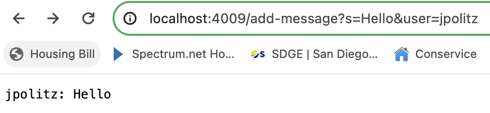

# Lab Report 2 - Servers and SSH Keys
## Part 1
codes for ```ChatServer```
```
import java.io.IOException;
import java.net.URI;

class Handler implements URLHandler {
    String result = "";
    public String handleRequest(URI url) {
        String query = url.getQuery();
        if(url.getPath().equals("/add-message")) {
            if(query.startsWith("s=")) {
                String parts = query.split("=")[1];
                String message = parts.split("&")[0];
                String user = query.split("=")[2];
                String old = user + ": " + message;
                result = result + old + "\n";
                return String.format("%s\n", result);
            }
        }
        return "404 Not Found!";
    }
}

class ChatServer {
    public static void main(String[] args) throws IOException {
        if(args.length == 0){
            System.out.println("Missing port number! Try any number between 1024 to 49151");
            return;
        }

        int port = Integer.parseInt(args[0]);

        Server.start(port, new Handler());
    }
}
```
using ```/add-message```

Screenshot 1


Screenshot 2 


## Part 2
run ```ls``` with the absolute path to the private key for SSH key for logging into ```ieng6```


run ```ls``` with the absolute path to the public key for SSH key for logging into ```ieng6```


log into ```ieng6``` without being asked for a password


## Part 3 
