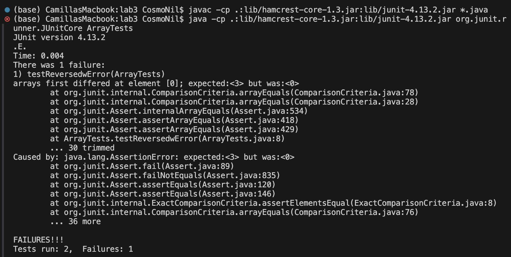

# Part 1 Bugs 
1. Failure-incuding input: 
```
@Test
  public void testReversedwError() {
    int[] input1 = {1,2,3};
    assertArrayEquals(new int[]{3,2,1}, ArrayExamples.reversed(input1));
  }
```
2. Input that doesn't induce a failure:
```
@Test
  public void testReversedNoError(){
    int [] input1 = { };
    assertArrayEquals(new int[]{ }, ArrayExamples.reversed(input1));
  }
```
3. Symptom: 
 
4. Bug:

Before: 
```
static int[] reversed(int[] arr) {
    int[] newArray = new int[arr.length];
    for(int i = 0; i < arr.length; i += 1) {
      arr[i] = newArray[arr.length - i - 1];
    }
    return arr;
  }
```

After: 
```
static int[] reversed(int[] arr) {
    int[] newArray = new int[arr.length];
    for(int i = 0; i < arr.length; i += 1) {
      newArray[i] = arr[arr.length - i - 1];
    }
    return newArray;
  }
```
5. Explanation
   
By changing `arr[i] = newArray[arr.length - i - 1]` to `newArray[i] = arr[arr.length - i - 1]` and changing `return arr` to `return newArray`,
the error is fixed by irritating through `arr` and putting elements into `newArray` in reversed order, then return `newArray`.
Previously, the code was irritating through `newArray` (whihc is empty) and putting elements into `arr`, and returning `arr` at the end, which is logically incorrect.
This error also explains why the code doesn't produce any error when `arr` is empty.     
   
# Part 2 Researching Command 
`grep` 

I goggled "grep command line options", and found a website with a list of `grep` command. [source link](https://www.geeksforgeeks.org/grep-command-in-unixlinux/) 
1. `grep -i ` Ignores, case for mathing.

Example 1:
```
(base) CamillasMacbook:docsearch CosmoNil$ grep -i "cardiovascular" technical/biomed/1468-6708-3-1.txt
        trials to detect survival differences or cardiovascular
          Study design: The Cardiovascular Health
          The Cardiovascular Health Study (CHS) is a
          cardiovascular disease (prevalent heart disease,
        CHS Cardiovascular Health Study
```
In this example, `grep -i ` searches for the word "cardiovascular" in the given file while ignoring the case of the letters. This command is useful for finding occurances of a specific word in a file without concerns about the case of the letter. 

Example 2:
```
CamillasMacbook:docsearch CosmoNil$ grep -i "complex" technical/plos/journal.pbio.0030076.txt
        preinitiation complex (PIC), promoter clearance, pausing, and arrest, and ended with
        (reviewed in [2]). This phosphorylation is critical for the recruitment of complexes that
        complex clears the promoter, the negative transcription elongation factor (N-TEF) is
        the promoter cooperatively. Such arrested transcription complexes have now been found on
        and one of four possible C-type cyclins. When recruited to stalled transcription complexes,
        TAF-independent transcription complexes to the HIV LTR [14] (Figure 1). Possibly, this
        The assembly and disassembly of the complex between PTEFb, Tat, and TAR is a regulated
        process in vivo. Whereas the phosphorylation of CDK9 strengthens this complex [16], the
        Of interest, P-TEFb exists in two complexes in cells [22,23]. The larger measures
        complex, Cdk9 is enzymatically inactive. HEXIM1 was identified as the inducible gene
        growth signals liberate P-TEFb from the large complex in the course of cardiac hypertrophy
        actinomycin D and DRB to cells, the large complex is converted to the small complex to
        complexes play in the transcription of specific genes? How central will the regulation of
```
In this example, `grep -i ` searches for lines that includes "complex" in the given file while ignoring the case of letters, and I noticed that the plural form of "complex" is also included in the result. This flexibility accommodates variations in case and pluralization, making the search more inclusive. 

2. `grep -l ` Displays list of filenames only.

Example 1:
```
(base) CamillasMacbook:docsearch CosmoNil$ grep -l "RNA" technical/biomed/*.txt
technical/biomed/1471-2091-2-11.txt
technical/biomed/1471-2091-2-13.txt
technical/biomed/1471-2091-2-5.txt
technical/biomed/1471-2091-3-14.txt
technical/biomed/1471-2091-3-18.txt
technical/biomed/1471-2091-3-22.txt
technical/biomed/1471-2091-3-23.txt
technical/biomed/1471-2105-2-1.txt
technical/biomed/1471-2105-2-8.txt
technical/biomed/1471-2105-3-17.txt
technical/biomed/1471-2105-3-18.txt
technical/biomed/1471-2105-3-2.txt
technical/biomed/1471-2105-3-22.txt
technical/biomed/1471-2105-3-23.txt
technical/biomed/1471-2105-3-26.txt
technical/biomed/1471-2105-3-3.txt
technical/biomed/1471-2105-3-4.txt
technical/biomed/1471-2105-4-26.txt
technical/biomed/1471-2105-4-27.txt
technical/biomed/1471-2121-1-2.txt
technical/biomed/1471-2121-2-11.txt
technical/biomed/1471-2121-2-15.txt
technical/biomed/1471-2121-2-3.txt
technical/biomed/1471-2121-2-6.txt
technical/biomed/1471-2121-3-13.txt
technical/biomed/1471-2121-3-18.txt
technical/biomed/1471-2121-3-22.txt
technical/biomed/1471-2121-3-25.txt
technical/biomed/1471-2121-3-30.txt
technical/biomed/1471-2121-3-6.txt
technical/biomed/1471-2121-3-8.txt
technical/biomed/1471-2121-4-1.txt
technical/biomed/1471-2121-4-3.txt
technical/biomed/1471-2121-4-4.txt
technical/biomed/1471-2121-4-6.txt
technical/biomed/1471-213X-1-1.txt
technical/biomed/1471-213X-1-10.txt
technical/biomed/1471-213X-1-13.txt
technical/biomed/1471-213X-1-15.txt
technical/biomed/1471-213X-1-2.txt
technical/biomed/1471-213X-1-9.txt
technical/biomed/1471-213X-2-1.txt
technical/biomed/1471-213X-2-8.txt
technical/biomed/1471-213X-3-2.txt
technical/biomed/1471-213X-3-3.txt
technical/biomed/1471-213X-3-4.txt
technical/biomed/1471-2148-1-1.txt
technical/biomed/1471-2148-1-8.txt
technical/biomed/1471-2148-2-15.txt
technical/biomed/1471-2148-2-7.txt
technical/biomed/1471-2148-2-8.txt
technical/biomed/1471-2148-3-18.txt
technical/biomed/1471-2148-3-3.txt
technical/biomed/1471-2148-3-7.txt
technical/biomed/1471-2156-2-17.txt
technical/biomed/1471-2156-2-5.txt
technical/biomed/1471-2156-2-8.txt
technical/biomed/1471-2156-3-11.txt
technical/biomed/1471-2156-3-16.txt
technical/biomed/1471-2156-3-4.txt
technical/biomed/1471-2156-4-5.txt
technical/biomed/1471-2156-4-9.txt
technical/biomed/1471-2164-2-1.txt
technical/biomed/1471-2164-2-2.txt
technical/biomed/1471-2164-2-6.txt
technical/biomed/1471-2164-2-7.txt
technical/biomed/1471-2164-2-8.txt
technical/biomed/1471-2164-2-9.txt
technical/biomed/1471-2164-3-1.txt
technical/biomed/1471-2164-3-13.txt
technical/biomed/1471-2164-3-15.txt
technical/biomed/1471-2164-3-16.txt
technical/biomed/1471-2164-3-18.txt
technical/biomed/1471-2164-3-19.txt
technical/biomed/1471-2164-3-24.txt
technical/biomed/1471-2164-3-26.txt
technical/biomed/1471-2164-3-27.txt
technical/biomed/1471-2164-3-28.txt
technical/biomed/1471-2164-3-29.txt
technical/biomed/1471-2164-3-30.txt
technical/biomed/1471-2164-3-31.txt
technical/biomed/1471-2164-3-32.txt
technical/biomed/1471-2164-3-33.txt
technical/biomed/1471-2164-3-34.txt
technical/biomed/1471-2164-3-35.txt
technical/biomed/1471-2164-3-4.txt
technical/biomed/1471-2164-3-6.txt
technical/biomed/1471-2164-3-7.txt
technical/biomed/1471-2164-3-9.txt
technical/biomed/1471-2164-4-13.txt
technical/biomed/1471-2164-4-14.txt
technical/biomed/1471-2164-4-15.txt
technical/biomed/1471-2164-4-16.txt
technical/biomed/1471-2164-4-19.txt
technical/biomed/1471-2164-4-2.txt
technical/biomed/1471-2164-4-22.txt
technical/biomed/1471-2164-4-23.txt
technical/biomed/1471-2164-4-24.txt
technical/biomed/1471-2164-4-25.txt
technical/biomed/1471-2164-4-26.txt
technical/biomed/1471-2164-4-28.txt
technical/biomed/1471-2164-4-4.txt
technical/biomed/1471-2164-4-5.txt
technical/biomed/1471-2172-1-1.txt
technical/biomed/1471-2172-2-10.txt
technical/biomed/1471-2172-3-1.txt
technical/biomed/1471-2172-3-10.txt
technical/biomed/1471-2172-3-12.txt
technical/biomed/1471-2172-3-16.txt
technical/biomed/1471-2172-3-9.txt
technical/biomed/1471-2172-4-2.txt
technical/biomed/1471-2180-1-12.txt
technical/biomed/1471-2180-1-26.txt
technical/biomed/1471-2180-1-28.txt
technical/biomed/1471-2180-1-29.txt
technical/biomed/1471-2180-1-31.txt
technical/biomed/1471-2180-1-33.txt
technical/biomed/1471-2180-1-34.txt
technical/biomed/1471-2180-1-8.txt
technical/biomed/1471-2180-2-13.txt
technical/biomed/1471-2180-2-20.txt
technical/biomed/1471-2180-2-26.txt
technical/biomed/1471-2180-2-29.txt
technical/biomed/1471-2180-2-38.txt
technical/biomed/1471-2180-2-7.txt
technical/biomed/1471-2180-3-10.txt
technical/biomed/1471-2180-3-11.txt
technical/biomed/1471-2180-3-13.txt
technical/biomed/1471-2180-3-4.txt
technical/biomed/1471-2180-3-5.txt
technical/biomed/1471-2180-3-9.txt
technical/biomed/1471-2199-2-10.txt
technical/biomed/1471-2199-2-12.txt
technical/biomed/1471-2199-2-3.txt
technical/biomed/1471-2199-2-4.txt
technical/biomed/1471-2199-2-5.txt
technical/biomed/1471-2199-2-6.txt
technical/biomed/1471-2199-3-10.txt
technical/biomed/1471-2199-3-11.txt
technical/biomed/1471-2199-3-17.txt
technical/biomed/1471-2199-3-7.txt
technical/biomed/1471-2199-4-4.txt
technical/biomed/1471-2202-2-12.txt
technical/biomed/1471-2202-2-16.txt
technical/biomed/1471-2202-2-17.txt
technical/biomed/1471-2202-2-20.txt
technical/biomed/1471-2202-2-3.txt
technical/biomed/1471-2202-2-7.txt
technical/biomed/1471-2202-3-11.txt
technical/biomed/1471-2202-3-16.txt
technical/biomed/1471-2202-3-17.txt
technical/biomed/1471-2202-3-20.txt
technical/biomed/1471-2202-3-3.txt
technical/biomed/1471-2202-3-4.txt
technical/biomed/1471-2202-3-5.txt
technical/biomed/1471-2202-4-10.txt
technical/biomed/1471-2202-4-11.txt
technical/biomed/1471-2202-4-17.txt
technical/biomed/1471-2202-4-2.txt
technical/biomed/1471-2202-4-3.txt
technical/biomed/1471-2202-4-6.txt
technical/biomed/1471-2210-1-10.txt
technical/biomed/1471-2210-1-2.txt
technical/biomed/1471-2210-1-7.txt
technical/biomed/1471-2210-2-14.txt
technical/biomed/1471-2210-2-4.txt
technical/biomed/1471-2210-2-9.txt
technical/biomed/1471-2229-2-11.txt
technical/biomed/1471-2229-2-3.txt
technical/biomed/1471-2229-2-4.txt
technical/biomed/1471-2229-2-9.txt
technical/biomed/1471-2261-1-6.txt
technical/biomed/1471-2261-2-11.txt
technical/biomed/1471-2261-3-4.txt
technical/biomed/1471-230X-1-10.txt
technical/biomed/1471-230X-1-5.txt
technical/biomed/1471-230X-1-6.txt
technical/biomed/1471-230X-2-23.txt
technical/biomed/1471-2334-1-9.txt
technical/biomed/1471-2334-2-5.txt
technical/biomed/1471-2334-2-7.txt
technical/biomed/1471-2334-3-10.txt
technical/biomed/1471-2334-3-12.txt
technical/biomed/1471-2334-3-15.txt
technical/biomed/1471-2350-2-11.txt
technical/biomed/1471-2350-3-12.txt
technical/biomed/1471-2407-1-15.txt
technical/biomed/1471-2407-1-19.txt
technical/biomed/1471-2407-2-15.txt
technical/biomed/1471-2407-2-16.txt
technical/biomed/1471-2407-2-18.txt
technical/biomed/1471-2407-2-9.txt
technical/biomed/1471-2407-3-3.txt
technical/biomed/1471-2415-3-3.txt
technical/biomed/1471-2415-3-5.txt
technical/biomed/1471-2431-2-12.txt
technical/biomed/1471-2431-2-4.txt
technical/biomed/1471-2458-2-18.txt
technical/biomed/1471-2458-3-5.txt
technical/biomed/1471-2466-3-1.txt
technical/biomed/1471-2474-2-2.txt
technical/biomed/1472-6750-1-13.txt
technical/biomed/1472-6750-1-6.txt
technical/biomed/1472-6750-1-8.txt
technical/biomed/1472-6750-2-14.txt
technical/biomed/1472-6750-2-21.txt
technical/biomed/1472-6750-3-6.txt
technical/biomed/1472-6793-1-11.txt
technical/biomed/1472-6793-1-15.txt
technical/biomed/1472-6793-2-4.txt
technical/biomed/1472-6793-2-8.txt
technical/biomed/1472-6793-3-4.txt
technical/biomed/1472-6793-3-5.txt
technical/biomed/1472-6807-3-1.txt
technical/biomed/1475-2867-2-7.txt
technical/biomed/1475-2867-3-12.txt
technical/biomed/1475-2867-3-2.txt
technical/biomed/1475-2867-3-3.txt
technical/biomed/1475-2875-1-5.txt
technical/biomed/1475-2875-2-14.txt
technical/biomed/1475-2875-2-4.txt
technical/biomed/1475-4924-1-10.txt
technical/biomed/1475-4924-1-5.txt
technical/biomed/1475-9268-1-1.txt
technical/biomed/1476-4598-1-3.txt
technical/biomed/1476-4598-1-6.txt
technical/biomed/1476-4598-1-8.txt
technical/biomed/1476-4598-2-2.txt
technical/biomed/1476-4598-2-20.txt
technical/biomed/1476-4598-2-24.txt
technical/biomed/1476-4598-2-25.txt
technical/biomed/1476-4598-2-3.txt
technical/biomed/1476-511X-1-2.txt
technical/biomed/1476-9433-1-2.txt
technical/biomed/1476-9433-1-3.txt
technical/biomed/1477-5956-1-1.txt
technical/biomed/1477-7827-1-13.txt
technical/biomed/1477-7827-1-17.txt
technical/biomed/1477-7827-1-23.txt
technical/biomed/1477-7827-1-27.txt
technical/biomed/1477-7827-1-36.txt
technical/biomed/1477-7827-1-54.txt
technical/biomed/1477-7827-1-9.txt
technical/biomed/1478-1336-1-2.txt
technical/biomed/1478-1336-1-3.txt
technical/biomed/1478-1336-1-4.txt
technical/biomed/ar104.txt
technical/biomed/ar120.txt
technical/biomed/ar130.txt
technical/biomed/ar149.txt
technical/biomed/ar321.txt
technical/biomed/ar331.txt
technical/biomed/ar407.txt
technical/biomed/ar409.txt
technical/biomed/ar430.txt
technical/biomed/ar601.txt
technical/biomed/ar68.txt
technical/biomed/ar774.txt
technical/biomed/ar778.txt
technical/biomed/ar792.txt
technical/biomed/bcr284.txt
technical/biomed/bcr303.txt
technical/biomed/bcr317.txt
technical/biomed/bcr45.txt
technical/biomed/bcr588.txt
technical/biomed/bcr602.txt
technical/biomed/bcr620.txt
technical/biomed/bcr631.txt
technical/biomed/cc300.txt
technical/biomed/cvm-2-6-278.txt
technical/biomed/gb-2000-1-1-research002.txt
technical/biomed/gb-2000-1-2-research0003.txt
technical/biomed/gb-2001-2-10-research0041.txt
technical/biomed/gb-2001-2-10-research0042.txt
technical/biomed/gb-2001-2-12-research0051.txt
technical/biomed/gb-2001-2-12-research0053.txt
technical/biomed/gb-2001-2-12-research0054.txt
technical/biomed/gb-2001-2-12-research0055.txt
technical/biomed/gb-2001-2-2-research0004.txt
technical/biomed/gb-2001-2-3-research0007.txt
technical/biomed/gb-2001-2-3-research0008.txt
technical/biomed/gb-2001-2-4-research0010.txt
technical/biomed/gb-2001-2-4-research0011.txt
technical/biomed/gb-2001-2-4-research0012.txt
technical/biomed/gb-2001-2-4-research0014.txt
technical/biomed/gb-2001-2-6-research0018.txt
technical/biomed/gb-2001-2-6-research0020.txt
technical/biomed/gb-2001-2-6-research0021.txt
technical/biomed/gb-2001-2-7-research0025.txt
technical/biomed/gb-2001-2-8-research0031.txt
technical/biomed/gb-2001-2-8-research0032.txt
technical/biomed/gb-2001-2-9-research0035.txt
technical/biomed/gb-2001-2-9-research0037.txt
technical/biomed/gb-2001-3-1-research0001.txt
technical/biomed/gb-2001-3-1-research0004.txt
technical/biomed/gb-2001-3-1-research0005.txt
technical/biomed/gb-2002-3-10-research0052.txt
technical/biomed/gb-2002-3-10-research0053.txt
technical/biomed/gb-2002-3-10-research0055.txt
technical/biomed/gb-2002-3-11-research0061.txt
technical/biomed/gb-2002-3-11-research0062.txt
technical/biomed/gb-2002-3-11-research0065.txt
technical/biomed/gb-2002-3-12-research0071.txt
technical/biomed/gb-2002-3-12-research0077.txt
technical/biomed/gb-2002-3-12-research0078.txt
technical/biomed/gb-2002-3-12-research0079.txt
technical/biomed/gb-2002-3-12-research0080.txt
technical/biomed/gb-2002-3-12-research0081.txt
technical/biomed/gb-2002-3-12-research0082.txt
technical/biomed/gb-2002-3-12-research0083.txt
technical/biomed/gb-2002-3-12-research0085.txt
technical/biomed/gb-2002-3-12-research0086.txt
technical/biomed/gb-2002-3-12-research0087.txt
technical/biomed/gb-2002-3-12-research0088.txt
technical/biomed/gb-2002-3-2-research0008.txt
technical/biomed/gb-2002-3-2-research0009.txt
technical/biomed/gb-2002-3-3-research0012.txt
technical/biomed/gb-2002-3-4-research0018.txt
technical/biomed/gb-2002-3-4-research0019.txt
technical/biomed/gb-2002-3-5-research0020.txt
technical/biomed/gb-2002-3-5-research0021.txt
technical/biomed/gb-2002-3-5-research0022.txt
technical/biomed/gb-2002-3-5-research0025.txt
technical/biomed/gb-2002-3-6-research0029.txt
technical/biomed/gb-2002-3-6-software0001.txt
technical/biomed/gb-2002-3-7-research0032.txt
technical/biomed/gb-2002-3-7-research0035.txt
technical/biomed/gb-2002-3-7-research0036.txt
technical/biomed/gb-2002-3-7-research0037.txt
technical/biomed/gb-2002-3-8-research0038.txt
technical/biomed/gb-2002-3-8-research0039.txt
technical/biomed/gb-2002-3-8-research0040.txt
technical/biomed/gb-2002-3-9-research0043.txt
technical/biomed/gb-2002-3-9-research0044.txt
technical/biomed/gb-2002-3-9-research0045.txt
technical/biomed/gb-2002-3-9-research0046.txt
technical/biomed/gb-2002-3-9-research0048.txt
technical/biomed/gb-2002-3-9-research0051.txt
technical/biomed/gb-2002-4-1-r1.txt
technical/biomed/gb-2002-4-1-r2.txt
technical/biomed/gb-2003-4-1-r5.txt
technical/biomed/gb-2003-4-1-r7.txt
technical/biomed/gb-2003-4-2-r11.txt
technical/biomed/gb-2003-4-2-r14.txt
technical/biomed/gb-2003-4-2-r16.txt
technical/biomed/gb-2003-4-2-r8.txt
technical/biomed/gb-2003-4-2-r9.txt
technical/biomed/gb-2003-4-3-r17.txt
technical/biomed/gb-2003-4-3-r18.txt
technical/biomed/gb-2003-4-3-r20.txt
technical/biomed/gb-2003-4-4-r26.txt
technical/biomed/gb-2003-4-5-r30.txt
technical/biomed/gb-2003-4-5-r32.txt
technical/biomed/gb-2003-4-6-r37.txt
technical/biomed/gb-2003-4-6-r39.txt
technical/biomed/gb-2003-4-7-r42.txt
technical/biomed/gb-2003-4-7-r43.txt
technical/biomed/gb-2003-4-7-r46.txt
technical/biomed/gb-2003-4-8-r50.txt
technical/biomed/gb-2003-4-9-r60.txt
technical/biomed/rr166.txt
technical/biomed/rr171.txt
technical/biomed/rr172.txt
technical/biomed/rr191.txt
technical/biomed/rr196.txt
technical/biomed/rr74.txt
```
In this case, `grep -l ` searches and displays the name of the files that contain the word "RNA" in `biomed` folder. By only displaying the filenames instead of matchign lines, `grep -l `mimnimizes the output displayed. 

Exmaple 2:
```
(base) CamillasMacbook:docsearch CosmoNil$ grep -l "medication" technical/plos/*.txt
technical/plos/journal.pbio.0020046.txt
technical/plos/pmed.0010010.txt
technical/plos/pmed.0010013.txt
technical/plos/pmed.0010042.txt
technical/plos/pmed.0010045.txt
technical/plos/pmed.0010048.txt
technical/plos/pmed.0010051.txt
technical/plos/pmed.0010058.txt
technical/plos/pmed.0010062.txt
technical/plos/pmed.0020040.txt
technical/plos/pmed.0020059.txt
technical/plos/pmed.0020098.txt
technical/plos/pmed.0020123.txt
technical/plos/pmed.0020140.txt
technical/plos/pmed.0020160.txt
technical/plos/pmed.0020162.txt
technical/plos/pmed.0020182.txt
technical/plos/pmed.0020187.txt
technical/plos/pmed.0020209.txt
technical/plos/pmed.0020246.txt
```
Similarly, in this example, `grep -l ` searches and displays the name of the files that contain the word "medication" in `plos` folder. Again, the amount output is minimized by printing only the file names. 

3. `grep -o ` Print only the matched parts of a matchingn line, with each such part on a separate output line. 
   
Example 1:
```
(base) CamillasMacbook:docsearch CosmoNil$ grep -o "genetic variation" technical/plos/journal.pbio.0
020019.txt
genetic variation
genetic variation
genetic variation
genetic variation
genetic variation
genetic variation
genetic variation
genetic variation
genetic variation
```
In this example, `grep -o ` is searching for the exact phrase "gentic variation" within the given file. This command is useful for extracting specific patterns from the file. 

Example 2: 
```
(base) CamillasMacbook:docsearch CosmoNil$ grep -o "biosynthetic pathways" technical/biomed/1471-209
1-2-11.txt
biosynthetic pathways
```
In this example, `grep -o ` is searching for the exact phrase "biosynthetic pathways" within the given file. This command is useful to search for very specific phrases in a given file. 

4. `grep -A n ` Prints searched line and nlines after the result.

Example 1:
```
(base) CamillasMacbook:docsearch CosmoNil$ grep -A 2 "study" technical/biomed/1471-2091-2-11.txt
          study because this cell line has bile acid uptake
          activity that was comparable to McNtcp.24 cells [ 17 ] .
          LDH activity in the culture medium of McNtcp.24 cells
--
        In this study, we determined if the differential
        sensitivity elaborated by the liver-derived McNtcp.24 cell
        line to different classes of conjugated bile acids is
--
        In contrast, our study shows that taurine-conjugated bile
        acids is toxic to a cell type that is not normally exposed
        to bile acids. Liver cells, which normally metabolize bile
--
        fractions from McNtpc.24 agrees with a previous study
        showing that TCA increases PI3K activity in canalicular and
        sinusoidal membrane vesicles [ 16 ] . The activation of
```
In this example, `grep -A n ` displays the lines with keyword "study" and 2 lines after the result. This command is useful for displaying context around matched words. 

Example 2: 
```
(base) CamillasMacbook:docsearch CosmoNil$ grep -A 1 "tumours" technical/plos/journal.pbio.0020040.t
xt
        tumours in these predisposed patients, the remaining wild-type copy of the tumour
        suppressor gene was lost, a process referred to as loss of heterozygosity.
--
        EMBO Journal describing a detailed study of tumours in mice lacking one
        copy of the p53 tumour suppressor gene (
--
        Trp53 wild-type allele in the tumours. According to the two-hit model, it
        was expected that in these tumours this copy would have been lost or inactivated. However,
        this turned out not to be the case. Half of the tumours from mice younger than 18 months
        were found to have retained the wild-type copy of 
--
        two tumours, the researchers sequenced the complete coding region of the remaining
        wild-type allele and showed it was structurally intact. To exclude the possibility of
--
        tumours was expressed normally and suggested it had a normal wild-type conformation.
        Next, the authors did a rigorous test of different functions of the p53 protein. They
--
        first tested whether the tumours showed amplification of Mdm2. This protein, whose
        expression is regulated by p53, stimulates breakdown of p53, thereby forming a negative
--
        feedback mechanism that keeps p53 levels low. Some tumours therefore amplify the 
        Mdm2 gene as a means of inactivating p53. However, this was not found in
--
        the tumours from the 
        Trp53
--
        p53-dependent apoptosis, and, indeed, in tumours that had retained the wild-type allele,
        irradiation did lead to an increase in apoptosis, whereas in tumours that had lost the
        wild-type allele, it did not.
--
        Pcna ) in p53-positive tumours after irradiation and showed responses
        indicative of normal p53 function. Furthermore, it was shown that the p53 protein from the
--
        tumours was able to bind to a p53-binding DNA sequence in an in vitro setting. Finally,
        since it is known that p53 absence in tumours is correlated with chromosomal instability,
        Venkatachalam et al. (1998) used comparative genome hybridisation to compare this feature
--
        between p53-negative and p53-positive tumours and found a 5-fold greater stability in the
        latter.
--
        +/− tumours the wild-type allele of 
        Trp53 is not only retained, but also appears to function normally. This
```
Similarly, in this example, `grep -A n ` displays the lines with keyword "tumours" and 1 line after the result. This command is useful for to see the relevant information related to matched word. 
