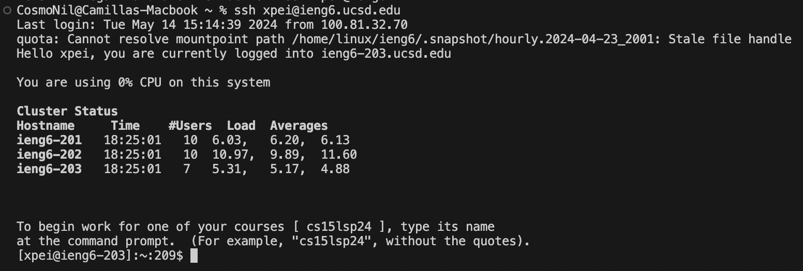
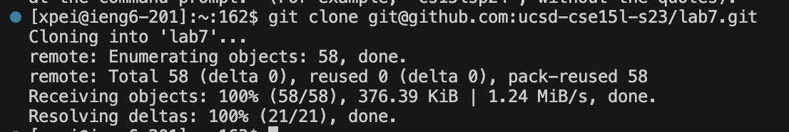

# Lab Report 4 Vim 
## step 4: Log into ieng6

Keys pressed: I connected to remote SSH (no specific commands used, using clicking with mouse). 
## step 5: clone fork 

Keys pressed: `git clone <command> <v> <enter>`. 
I copied the link of fork of the repository from my Github account using the `ssh` URL, so I used `git clone` and pasted the link to my terminal. 
step 6: run the tests, demonstrating that they fail 
step 7: edit the code
step 8: run the tests 
step 9: commit and push 
