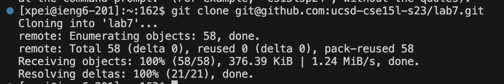
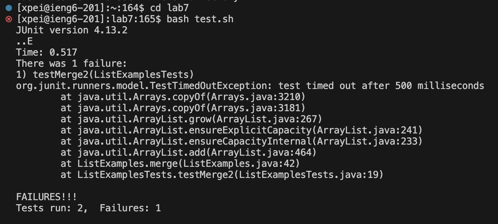
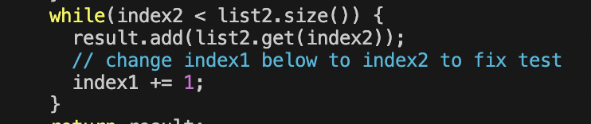
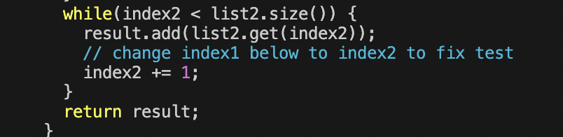

# Lab Report 4 Vim 
## step 4: Log into ieng6

I connected to remote SSH No specific commands used, using clicking with mouse. 

## step 5: clone fork 

Keys pressed: `git clone <command> <v> <enter>`

I copied the link of fork of the repository from my Github account using the `ssh` URL, so I used `git clone` and pasted the link to my terminal. 

## step 6: run the tests, demonstrating that they fail 

Keys pressed: `cd lab7 <enter>`, `bash test.sh <enter>`

I used cd to change the current wokring directory to `lab7`, then run the tests by using command `bash test.sh`. 
The code has an error in `ListExamples`. 

## step 7: edit the code

Keys pressed: `vim ListExamples.java <enter>`, `x`, `i 2 <esc>`, `: wq <enter>`
I used `vim ListExamples.java` to open the the file in vim. I found the line where the error is, and used `x` command to delete `1`. I used `i` command to enter insert mode, and pressed `2`. I used `<esc>` to exit insert mode, and used `: wq` to save and exit the file. 

## step 8: run the tests 

Keys pressed: `bash test.sh <enter>` 
I used `bash test.sh` to run the test again, and no errors are shown. 

step 9: commit and push 
