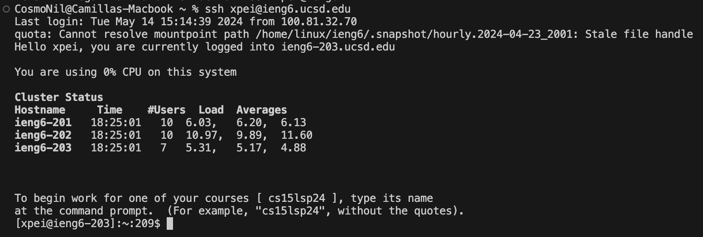
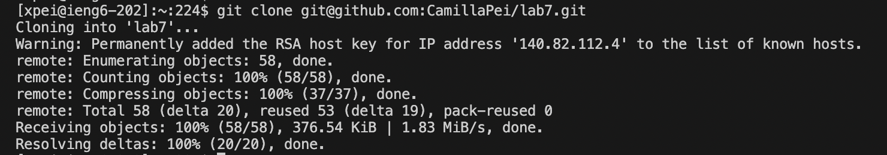
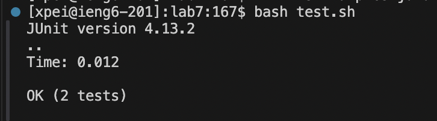
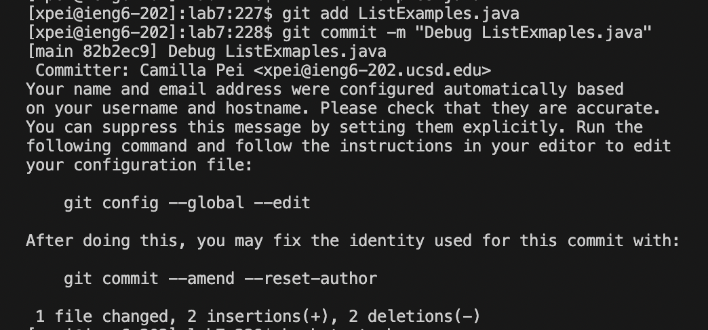
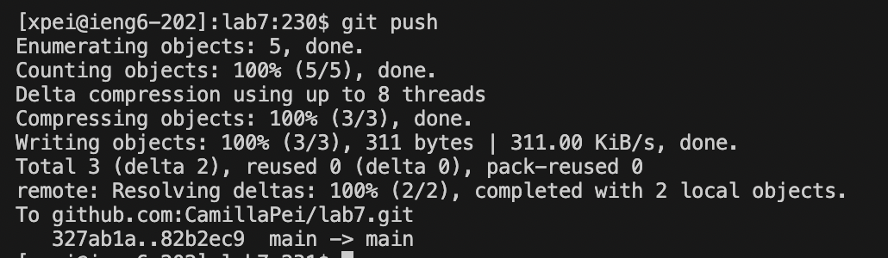

# Lab Report 4 Vim 
## step 4: Log into ieng6

Keys pressed: `ssh <space> xpei@ieng6.ucsd.edu <enter>`

I connected to remote SSH by using `ssh` and typing my username. 

## step 5: clone fork 

Keys pressed: `git <space> clone <space> <command> <v> <enter>`

To clone my fork of the repository from my Github account using `ssh` url, I used `git clone` and pasted the link to my terminal. 

## step 6: run the tests, demonstrating that they fail 

Keys pressed: `cd <space> lab7 <enter>`, `bash <space> test.sh <enter>`

I used `cd` to change the current wokring directory to `lab7`, then run the tests by using command `bash test.sh`. 
The code has an error in `ListExamplesTest`. 

## step 7: edit the code

Keys pressed: `vim <space> ListExamples.java <enter>`,
I pressed `<down>` 43 times, then `<right>` 12 times, then `x`, then `i2 <esc>`, then `:wq <enter>`

I used `vim ListExamples.java` to open the the file in vim. I moved my cursor to line 43 using the down arrow, then moved to the place where the error is by pressing right arrow 12 times. Then I used `x` command to delete `1`. I used `i` command to enter insert mode, and pressed `2` to fix the error in that line. Then, I used `<esc>` to exit insert mode, and used `:wq` to save and exit the file. 

## step 8: run the tests 

Keys pressed: `bash <space> test.sh <enter>` 

I used `bash test.sh` to run the test again, and no errors were shown. 

## step 9: commit and push 

Keys pressed: 'git <space> add <space> ListExamples.java <enter>`, `git <space> commit <space> -m <space> "Debug <space> ListExamples.java" <enter>`, `git <space> push <enter>`

I used `git add` to stage the changes I made to `ListExamples.java`, then I used `git commit -m` to commit and specify a commit message inline. In this case, the message is `"Debug Listexamples.java"`. Lastly, I used `git push` to push to upload local repository content to a remote repository. 

