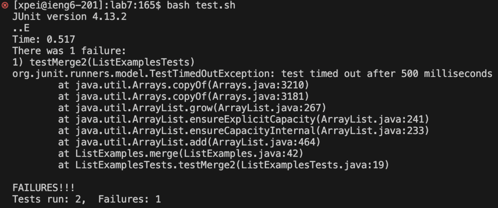

note: code was taken from week 7 lab. 
# Part 1 Debugging Scenario

### 1. Original Post from Student

Title: Help! My Bash script isn't running my Java program correctly.

Post:
Hi,

I'm having trouble with my Bash script that's supposed to compile and run my Java program. 
The script ran without errors, but my there were two failures in `ListExampleTests` . 
Here is a screenshot of my terminal:


Based on what I saw in my terminal, there were two failures in `ListExamplesTests`. The first one was in `testFilter` where the actual output was inconsistent with the expected output. The second one was in `testMerge2` that resulted a `test timed out` error. The other 3 tests in `ListExamplesTests` passed. 

I check my code, and I think that the failure-inducing input were in `merge` and `filter` method. There might be something wrong with how the `merge` method were handling the input lists and how the `filter` method was appending the list. 

Here's the relevant part of my Bash script:

`bash`
```
javac -cp .:lib/hamcrest-core-1.3.jar:lib/junit-4.13.2.jar *.java
java -cp .:lib/hamcrest-core-1.3.jar:lib/junit-4.13.2.jar org.junit.runner.JUnitCore ListExamplesTests
``` 
And here's the merge method in my Java program:

java
Copy code

static List<String> merge(List<String> list1, List<String> list2) {
    List<String> result = new ArrayList<>();
    int index1 = 0, index2 = 0;
    while(index1 < list1.size() && index2 < list2.size()) {
        if(list1.get(index1).compareTo(list2.get(index2)) < 0) {
            result.add(list1.get(index1));
            index1 += 1;
        }
        else {
            result.add(list2.get(index2));
            index2 += 1;
        }
    }
    while(index1 < list1.size()) {
        result.add(list1.get(index1));
        index1 += 1;
    }
    while(index2 < list2.size()) {
        result.add(list2.get(index2));
        // change index1 below to index2 to fix test
        index1 += 1;
    }
    return result;
}

Any hints would be appreciate!

tags: lab 7

### 2. TA response
Response from TA:

Hi there!

It looks like your script is intended to compile and run JUnit tests for your Java program, but let's focus on the specific method you're having trouble with. 
Can you add a print statement to your merge method to see what the lists look like before and after merging? Also, it seems there's a comment suggesting a possible fix.
Can you try modifying the index1 increment to index2 in the last while loop?

Here's the updated merge method to try:

java
Copy code
static List<String> merge(List<String> list1, List<String> list2) {
    List<String> result = new ArrayList<>();
    int index1 = 0, index2 = 0;
    while(index1 < list1.size() && index2 < list2.size()) {
        if(list1.get(index1).compareTo(list2.get(index2)) < 0) {
            result.add(list1.get(index1));
            index1 += 1;
        }
        else {
            result.add(list2.get(index2));
            index2 += 1;
        }
    }
    while(index1 < list1.size()) {
        result.add(list1.get(index1));
        index1 += 1;
    }
    while(index2 < list2.size()) {
        result.add(list2.get(index2));
        index2 += 1;  // Changed from index1 to index2
    }
    return result;
}
Try running your script again after making this change.

### 3. Student's Follow-up Post: 
Title: Update: Tried modifying the merge method

Post:
Hi,

I tried modifying the merge method as you suggested. Here's the screenshot of my terminal after running the script:

screenshot

The lists are now merged correctly:

csharp
Copy code
[a, b, c, d, e, f]
Looks like the issue was indeed with the incorrect index increment in the last while loop. Thanks for the help!

### 4. All the information 
File & directory structure needed: 
```
/project
    |-- ListExamples.java
    |-- ListExamplesTests.java
    |-- test.sh
    |-- lib/
        |-- hamcrest-core-1.3.jar
        |-- junit-4.13.2.jar

```

The contents of each file before fixing the bug: 

`.gitignore`:
```
*.class
```

` ListExamples.java `:
```
import java.util.ArrayList;
import java.util.List;

interface StringChecker { boolean checkString(String s); }

class ListExamples {
  static List<String> filter(List<String> list, StringChecker sc) {
    List<String> result = new ArrayList<>();
    for(String s: list) {
      if(sc.checkString(s)) {
        result.add(0, s);
      }
    }
    return result;
  }

  static List<String> merge(List<String> list1, List<String> list2) {
    List<String> result = new ArrayList<>();
    int index1 = 0, index2 = 0;
    while(index1 < list1.size() && index2 < list2.size()) {
      if(list1.get(index1).compareTo(list2.get(index2)) < 0) {
        result.add(list1.get(index1));
        index1 += 1;
      }
      else {
        result.add(list2.get(index2));
        index2 += 1;
      }
    }
    while(index1 < list1.size()) {
      result.add(list1.get(index1));
      index1 += 1;
    }
    while(index2 < list2.size()) {
      result.add(list2.get(index2));
      index1 += 1;
    }
    return result;
  }
}
```

` ListExamplesTests.java `:
```
import static org.junit.Assert.*;
import org.junit.*;
import java.util.*;
import java.util.ArrayList;

public class ListExamplesTests {
	@Test(timeout = 500)
	public void testMerge1() {
    		List<String> l1 = new ArrayList<String>(Arrays.asList("x", "y"));
		List<String> l2 = new ArrayList<String>(Arrays.asList("a", "b"));
		assertArrayEquals(new String[]{ "a", "b", "x", "y"}, ListExamples.merge(l1, l2).toArray());
	}
	
	@Test(timeout = 500)
        public void testMerge2() {
		List<String> l1 = new ArrayList<String>(Arrays.asList("a", "b", "c"));
		List<String> l2 = new ArrayList<String>(Arrays.asList("c", "d", "e"));
		assertArrayEquals(new String[]{ "a", "b", "c", "c", "d", "e" }, ListExamples.merge(l1, l2).toArray());
        }

 @Test
  public void testFilter() {
    List<String> list = Arrays.asList("apple", "banana", "cherry", "date", "fig", "grape");
    List<String> result = ListExamples.filter(list, s -> s.contains("a"));
    assertEquals(Arrays.asList("apple", "banana", "date", "grape"), result);
  }

  @Test
  public void testFilterEmptyList() {
    List<String> list = Arrays.asList();
    List<String> result = ListExamples.filter(list, s -> s.contains("a"));
    assertEquals(Arrays.asList(), result);
  }

  @Test
  public void testFilterNoMatch() {
    List<String> list = Arrays.asList("blueberry", "kiwi", "mango");
    List<String> result = ListExamples.filter(list, s -> s.contains("z"));
    assertEquals(Arrays.asList(), result);
  }
}

}
```

` test.sh `: 
```
javac -cp .:lib/hamcrest-core-1.3.jar:lib/junit-4.13.2.jar *.java
java -cp .:lib/hamcrest-core-1.3.jar:lib/junit-4.13.2.jar org.junit.runner.JUnitCore ListExamplesTests
```

the full command line I ran to trigger the bug: 
`bash test.sh`

A description of what to edit to fix the bug: 
To fix the bugs, update the index increment in the last while loop of the merge method from `index1` to `index2` so that the code correctly appends elements to list2 instead of resulting in infinite loop. In filter method, change `result.add(0, s)` to `result.add(s)` so that the elemenets are added to the list in correct order. 
Fixed code: 
```
import java.util.ArrayList;
import java.util.List;

interface StringChecker { boolean checkString(String s); }

class ListExamples {
  static List<String> filter(List<String> list, StringChecker sc) {
    List<String> result = new ArrayList<>();
    for(String s: list) {
      if(sc.checkString(s)) {
        result.add(s);
      }
    }
    return result;
  }

  static List<String> merge(List<String> list1, List<String> list2) {
    List<String> result = new ArrayList<>();
    int index1 = 0, index2 = 0;
    while(index1 < list1.size() && index2 < list2.size()) {
      if(list1.get(index1).compareTo(list2.get(index2)) < 0) {
        result.add(list1.get(index1));
        index1 += 1;
      }
      else {
        result.add(list2.get(index2));
        index2 += 1;
      }
    }
    while(index1 < list1.size()) {
      result.add(list1.get(index1));
      index1 += 1;
    }
    while(index2 < list2.size()) {
      result.add(list2.get(index2));
      index2 += 1;
    }
    return result;
  }
}

```

# Part 2 – Reflection

In the second half of this quarter, I learned about the importance of carefully reviewing code logic and how subtle mistakes, like an incorrect index variable, can lead to significant issues. This experience has made me more diligent in debugging and understanding the flow of my programs.


