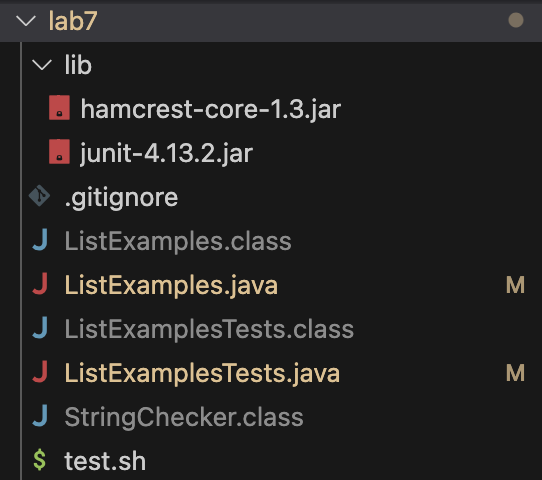

# Lab Report 5 - Putting in All Together
note: code was taken from week 7 lab. 

## Part 1 Debugging Scenario

### 1. Original Post from Student

Title: Bugs in my code

Post:
Hi,

I'm having trouble with my Bash script that's supposed to compile and run my Java program. 
The script ran without errors, but there were two failures in `ListExampleTests`. 
Here is a screenshot of my terminal:


Based on what I saw in my terminal, there were two failures in `ListExamplesTests`. The first one was in `testFilter` where the actual output was inconsistent with the expected output. The second one was in `testMerge2` that resulted a `test timed out` error. The other 3 tests in `ListExamplesTests` passed. 

I check my code, and I think that the failure-inducing input were in `merge` and `filter` method. There might be something wrong with how the `merge` method were handling the input lists and how the `filter` method was appending the list.

I pasted my codes below for references. 

Here's my code in `test.sh`:

```
javac -cp .:lib/hamcrest-core-1.3.jar:lib/junit-4.13.2.jar *.java
java -cp .:lib/hamcrest-core-1.3.jar:lib/junit-4.13.2.jar org.junit.runner.JUnitCore ListExamplesTests
```

There're the codes in my `ListExample.java`: 
```
import java.util.ArrayList;
import java.util.List;

interface StringChecker { boolean checkString(String s); }

class ListExamples {
  static List<String> filter(List<String> list, StringChecker sc) {
    List<String> result = new ArrayList<>();
    for(String s: list) {
      if(sc.checkString(s)) {
        result.add(0, s);
      }
    }
    return result;
  }
  static List<String> merge(List<String> list1, List<String> list2) {
    List<String> result = new ArrayList<>();
    int index1 = 0, index2 = 0;
    while(index1 < list1.size() && index2 < list2.size()) {
      if(list1.get(index1).compareTo(list2.get(index2)) < 0) {
        result.add(list1.get(index1));
        index1 += 1;
      }
      else {
        result.add(list2.get(index2));
        index2 += 1;
      }
    }
    while(index1 < list1.size()) {
      result.add(list1.get(index1));
      index1 += 1;
    }
    while(index2 < list2.size()) {
      result.add(list2.get(index2));
      index1 += 1;
    }
    return result;
  }
}
```

Here're the codes in my `ListExamplesTests.java`:
```
import static org.junit.Assert.*;
import org.junit.*;
import java.util.*;
import java.util.ArrayList;

public class ListExamplesTests {
	@Test(timeout = 500)
	public void testMerge1() {
    		List<String> l1 = new ArrayList<String>(Arrays.asList("x", "y"));
		List<String> l2 = new ArrayList<String>(Arrays.asList("a", "b"));
		assertArrayEquals(new String[]{ "a", "b", "x", "y"}, ListExamples.merge(l1, l2).toArray());
	}
	
	@Test(timeout = 500)
        public void testMerge2() {
		List<String> l1 = new ArrayList<String>(Arrays.asList("a", "b", "c"));
		List<String> l2 = new ArrayList<String>(Arrays.asList("c", "d", "e"));
		assertArrayEquals(new String[]{ "a", "b", "c", "c", "d", "e" }, ListExamples.merge(l1, l2).toArray());
        }

 	@Test
  	public void testFilter() {
    		List<String> list = Arrays.asList("apple", "banana", "cherry", "date", "fig", "grape");
 		List<String> result = ListExamples.filter(list, s -> s.contains("a"));
    		assertEquals(Arrays.asList("apple", "banana", "date", "grape"), result);
  	}

  	@Test
  	public void testFilterEmptyList() {
    		List<String> list = Arrays.asList();
    		List<String> result = ListExamples.filter(list, s -> s.contains("a"));
    		assertEquals(Arrays.asList(), result);
	}

	@Test
  	public void testFilterNoMatch() {
    		List<String> list = Arrays.asList("blueberry", "kiwi", "mango");
    		List<String> result = ListExamples.filter(list, s -> s.contains("z"));
    		assertEquals(Arrays.asList(), result);
  	}
}
```

Any help or hints would be appreciate!

tags: lab 7

### 2. TA response
Response from TA:

Hi there!

Let's focus on the specific method you're having trouble with. Firstly, the if statement in your your `filter` method, you have: 
```
if(sc.checkString(s)) {
        result.add(0, s);
}
```
By comparing the expected output and your actually output, what do you see? Think about what `add(int index, E element)` do to an array list. Is that the right order you want to add elements to the list? 

Secondly, in your `merge` method, you have: 
```
while(index1 < list1.size()) {
      result.add(list1.get(index1));
      index1 += 1;
}
while(index2 < list2.size()) {
	result.add(list2.get(index2));
      index1 += 1;
}
```
Your first while loop is perfectly fine. Could you compare the second while loop to the first one? What should you increment in your second while loop? 

I hope these are helpful and let me know if you have any questions!

### 3. Student's Follow-up Post: 
Title: Update

Post:
Hi,

Thank you for your reply and I found out where my bugs were! My first bug was in the `filter` method, where I put:
```
if(sc.checkString(s)) {
    result.add(0, s); 
}
```
`result.add(0, s)` was adding element s at the zeroth index of the list, thus resulting a reversed order. This bug was lead to inconsistent output with the expected output. 
I changed it to:

```
if(sc.checkString(s)) {
    result.add(s);  
}
```
Now element s are being added in order. 

My second bug was in the `merge` method: 
```
while(index2 < list2.size()) {
	result.add(list2.get(index2));
      index1 += 1;
    }
```
I was incrementing `index1` when I was supposed to increment `index2`. This mistake results an infinite loop since the value of `index2` was never incremented and therefore would be less than `list2.size()` as long as `list2` is not empty. This bug was causing the `test timed out` error. I changed the code to:
```
while(index2 < list2.size()) {
	result.add(list2.get(index2));
      index2 += 1;
    }
```
Now `index2` is being incremented as elements are added to `result`. 

Now all of my tests passed!


Thanks for your help!

## 4. All the information 
*File & directory structure needed:*



*The contents of each file before fixing the bug:*

`.gitignore`:
```
*.class
```

` ListExamples.java `:
```
import java.util.ArrayList;
import java.util.List;

interface StringChecker { boolean checkString(String s); }

class ListExamples {
  static List<String> filter(List<String> list, StringChecker sc) {
    List<String> result = new ArrayList<>();
    for(String s: list) {
      if(sc.checkString(s)) {
        result.add(0, s);
      }
    }
    return result;
  }

  static List<String> merge(List<String> list1, List<String> list2) {
    List<String> result = new ArrayList<>();
    int index1 = 0, index2 = 0;
    while(index1 < list1.size() && index2 < list2.size()) {
      if(list1.get(index1).compareTo(list2.get(index2)) < 0) {
        result.add(list1.get(index1));
        index1 += 1;
      }
      else {
        result.add(list2.get(index2));
        index2 += 1;
      }
    }
    while(index1 < list1.size()) {
      result.add(list1.get(index1));
      index1 += 1;
    }
    while(index2 < list2.size()) {
      result.add(list2.get(index2));
      index1 += 1;
    }
    return result;
  }
}
```

` ListExamplesTests.java `:
```
import static org.junit.Assert.*;
import org.junit.*;
import java.util.*;
import java.util.ArrayList;

public class ListExamplesTests {
	@Test(timeout = 500)
	public void testMerge1() {
    		List<String> l1 = new ArrayList<String>(Arrays.asList("x", "y"));
		List<String> l2 = new ArrayList<String>(Arrays.asList("a", "b"));
		assertArrayEquals(new String[]{ "a", "b", "x", "y"}, ListExamples.merge(l1, l2).toArray());
	}
	
	@Test(timeout = 500)
        public void testMerge2() {
		List<String> l1 = new ArrayList<String>(Arrays.asList("a", "b", "c"));
		List<String> l2 = new ArrayList<String>(Arrays.asList("c", "d", "e"));
		assertArrayEquals(new String[]{ "a", "b", "c", "c", "d", "e" }, ListExamples.merge(l1, l2).toArray());
        }

 	@Test
  	public void testFilter() {
 		List<String> list = Arrays.asList("apple", "banana", "cherry", "date", "fig", "grape");
    		List<String> result = ListExamples.filter(list, s -> s.contains("a"));
    		assertEquals(Arrays.asList("apple", "banana", "date", "grape"), result);
  	}

  	@Test
  	public void testFilterEmptyList() {
    		List<String> list = Arrays.asList();
    		List<String> result = ListExamples.filter(list, s -> s.contains("a"));
    		assertEquals(Arrays.asList(), result);
  	}

  	@Test
  	public void testFilterNoMatch() {
    		List<String> list = Arrays.asList("blueberry", "kiwi", "mango");
    		List<String> result = ListExamples.filter(list, s -> s.contains("z"));
    		assertEquals(Arrays.asList(), result);
  	}
}
```

` test.sh `: 
```
javac -cp .:lib/hamcrest-core-1.3.jar:lib/junit-4.13.2.jar *.java
java -cp .:lib/hamcrest-core-1.3.jar:lib/junit-4.13.2.jar org.junit.runner.JUnitCore ListExamplesTests
```

*the full command line I ran to trigger the bug:*

`bash test.sh`
This command produced the failing JUnit test outputs. 

*A description of what to edit to fix the bug:*

To fix the bugs, update the index increment in the last while loop of the `merge` method from `index1` to `index2` so that the code correctly appends elements to the new list and updating the index number instead of resulting in infinite loop and `time out` error. In `filter method`, change `result.add(0, s)` to `result.add(s)` so that the elemenets are added to the list in correct order. 
Fixed code: 
```
import java.util.ArrayList;
import java.util.List;

interface StringChecker { boolean checkString(String s); }

class ListExamples {
  static List<String> filter(List<String> list, StringChecker sc) {
    List<String> result = new ArrayList<>();
    for(String s: list) {
      if(sc.checkString(s)) {
        result.add(s);
      }
    }
    return result;
  }

  static List<String> merge(List<String> list1, List<String> list2) {
    List<String> result = new ArrayList<>();
    int index1 = 0, index2 = 0;
    while(index1 < list1.size() && index2 < list2.size()) {
      if(list1.get(index1).compareTo(list2.get(index2)) < 0) {
        result.add(list1.get(index1));
        index1 += 1;
      }
      else {
        result.add(list2.get(index2));
        index2 += 1;
      }
    }
    while(index1 < list1.size()) {
      result.add(list1.get(index1));
      index1 += 1;
    }
    while(index2 < list2.size()) {
      result.add(list2.get(index2));
      index2 += 1;
    }
    return result;
  }
}

```

The codes in all other files were unchanged. 

## Part 2 – Reflection

In the second half of this quarter, I learned a lot of useful techniques. For example, I learned about how to use vim when I don't have access of the file folders. I also learned how to use `jdb`, the Java Debugger, to debug efficiently. 


